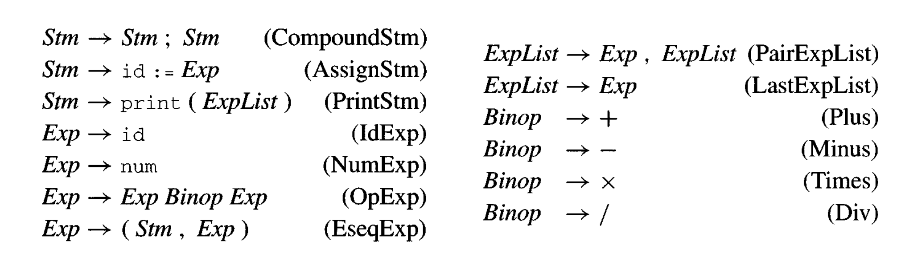

# Line Interpreter
A tree walking interpreter for a simple grammar, from Appel's Modern Compiler Implementation in ML.

## Usage
Install dependencies via opam:
```bash
opam install utop
cd line_interpret
utop 
```
Now you can run the line interpreter by executing `#use "line_interpret.ml;;` and `interp prog;;` in utop.   

## Grammar

 

## TODO
- Test directory of line programs
- Dune build file 

